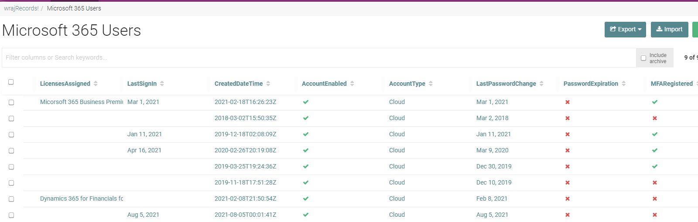
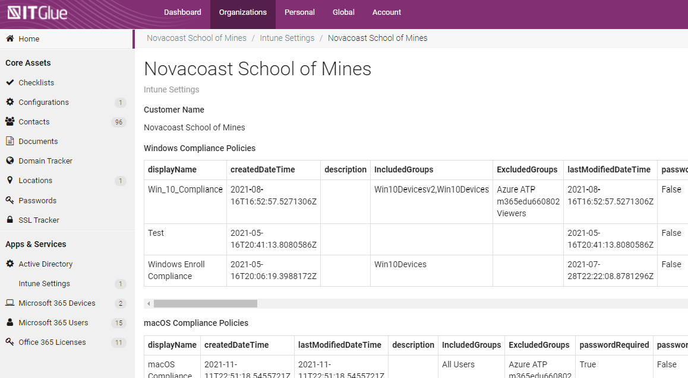
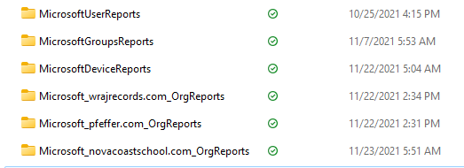

# M365 DOCUMENTATION

[](https://github.com/msp4msps)
[](https://github.com/msp4msps/m365_documentation)
[](https://github.com/msp4msps/m365_documentation)
[](https://choosealicense.com/licenses/mit/)

## Table of Contents

- [ Project Links ](#Project-Links)
- [ Screenshots](#Screenshots)
- [ Project Description ](#Project-Description)
- [ User Story ](#User-Story)
- [ Technologies ](#Technologies)
- [ Installation ](#Installation)
- [ Usage ](#Usage)
- [ Credits and Reference ](#Credits-and-Reference)
- [ Tests ](#Tests)
- [ Contributing ](#Contributing)
- [ Questions ](#Questions)
- [ License ](#License)

#

## Project Links

https://github.com/msp4msps/m365_documentation<br>
https://tminus365.com

## Screenshots-Demo

<kbd></kbd><kbd></kbd><kbd></kbd>

## Project Description

The following project was created to house scripts for documenting M365 tenants for customers that you manage. Today the documentation consist of CSV files and flexible assets in IT Glue. These scripts leverage the Secure Application model to create a secure connection to all customers under management in Partner Center.

## Information Collected

Microsoft Users

- DisplayName
- FirstName
- UPN
- Role
- JobTitle
- LicensesAssigned
- LastSignIn
- createdDateTime
- accountEnabled
- AccountType
- LastPasswordChange
- PasswordExpiration
- MFARegistered
- ExchangeLastActive
- MailboxStorageUsedGB
- MailboxItemCount
- HasArchive
- AuthMethod:Phone
- AuthMethod:Email
- OneDriveLastActive
- OneDriveStorageUsed
- OneDriveFileCount
- OneDriveViewed/EditedFileCount
- OneDriveSyncedFileCount
- OneDriveSharedInternalFileCount
- OneDriveSharedExternalFileCount
- SharePointLastActive
- SharePointViewed/EditedFileCount
- SharePointSyncedFileCount
- SharePointSharedInternalFileCount
- SharePointSharedExternalFileCount
- SharePointVisitedPageCount
- TeamsLastActive
- TeamsChatCount
- TeamsCallCount
- TeamsMeetingCount

## User Story

As an MSP, I would like granular documentation on users, groups, and organization settings that can help me be more proactive in managing customer environments.

## Technologies

```
Powershell
```

## Installation

1.Leverage the Create_Auth ps1 file if you have not already created an app registration to garner tokens for authenticating to customer environments. 2. Fork the repo to modify the scripts or leverage the scripts to start documenting customer environments.

## Usage

I would start by running single tenant scripts to see if that creates the information you are looking for and modifying accordingly. This is especially important in IT Glue where you may want to modify the format of the flexible asset.

## Credits and Reference

Kelvin Tegelaar for his work on the Secure Application Model that makes this possible. Gavin Stone for his script on garnering info on Conditional Access policies which I reused here. I will be looking to add this information into CIPP at a later date.

## Tests

Run against a single customer tenant

## Contributing

Open a pull request with any issues or feature enhancements.

## Questions

Contact the author with any questions!<br>
Github link: [msp4msps](https://github.com/msp4msps)<br>
Email: msp4msps@tminus365.com

## License

This project is [MIT](https://choosealicense.com/licenses/mit/) licensed.<br />
Copyright © 2021 [NICK ROSS](https://github.com/msp4msps)
